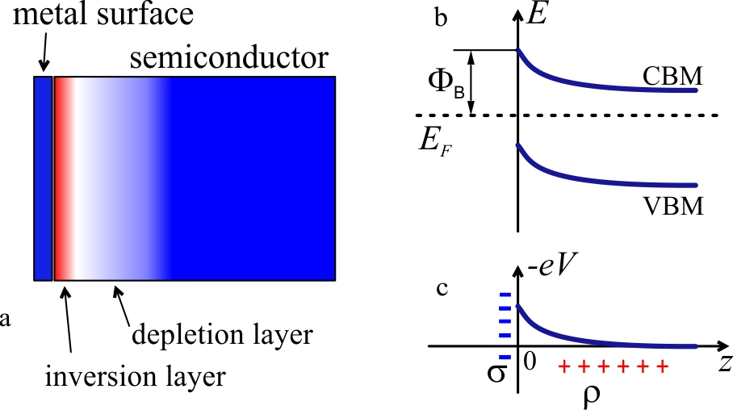

# First-Principles Method for Schottky Barrier

We develop a first-principles method for calculating Schottky barrier parameters. The Poisson equation is solved self-consistently with the electrostatic charge density over the entire barrier using the density functional theory (DFT) electronic structure converged locally, allowing computation of a Schottky barrier entirely from DFT involving thousands of atomic layers in the semiconductor. The induced charge in the bulk consists of conduction and valence band charges from doping and band bending, as well as charge from the evanescent states in the gap of the semiconductor. The Schottky barrier height is determined when the induced charge density and the induced electrostatic potential reach self-consistency. The Schottky barrier height, width, along with depletion and inversion layers obtained self-consistently as functions of temperature and bulk doping.

# Usage

Please see [Docs](Docs) folder for instructions how to install the code and [Examples](Examples) folder for some sample calculations. 

# Authors

[Dmitry Skachkov](mailto:dmitry.skachkov@dsedu.org)

[Xiao-Guang Znang](mailto:xgz@ufl.edu)

[Hai-Ping Cheng](mailto:ha.cheng@northeastern.edu)

# License

[AFL 3.0 License](LICENSE.md) 

# How to cite

If you use the SB package in your research, please cite the following publications:

* Dmitry Skachkov, Shuang-Long Liu, Yan Wang, Xiao-Guang Zhang, Hai-Ping Cheng  
"First-Principles Theory for Schottky Barrier Physics" Phys. Rev. B, 104, 045429 (2021) [DOI 10.1103/PhysRevB.104.045429](https://doi.org/10.1103/PhysRevB.104.045429)  

* D. Skachkov, X.-G. Zhang, H.-P. Cheng (2021) SB: First-Principles Method for Schottky Barrier. GitHub https://github.com/m2qm-efrc/SB  

See [BibTex](BibTex.md) entry for the Github repository and the publications
  
## For information about versions and updates see [VERSION.md](VERSION.md) 

## For features of the SB program see [FEATURES.md](FEATURES.md) 

## For development of the SB program see [DEVELOPMENT.md](DEVELOPMENT.md) 

